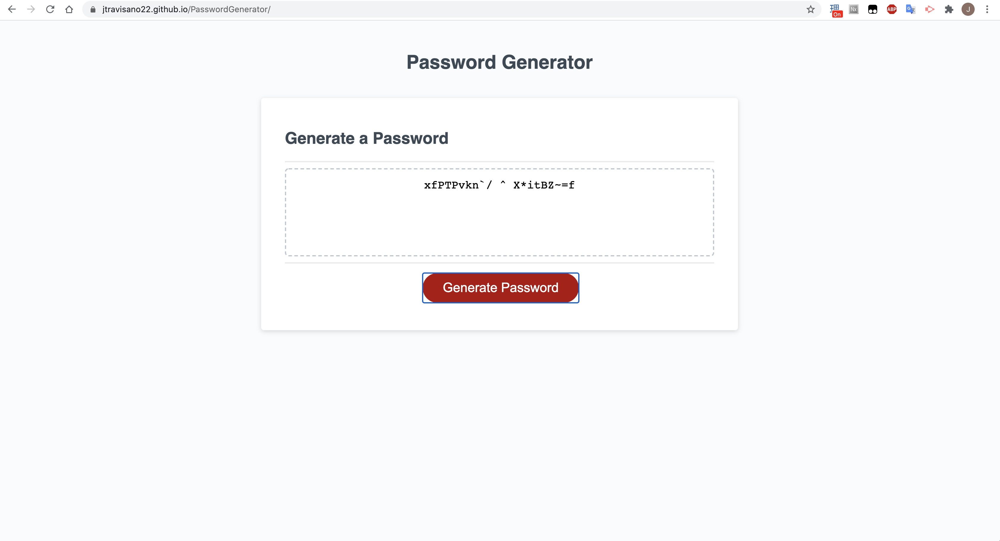

# PasswordGenerator

The Password Generator homework assignment was created in JavaScript and is able to generate random passwords that include the following: lowercase letters, uppercase letters, numbers, and special characters. Password length is between 8 and 128 characters long, depending on the user's choice.

## Screenshot

https://jtravisano22.github.io/PasswordGenerator/
